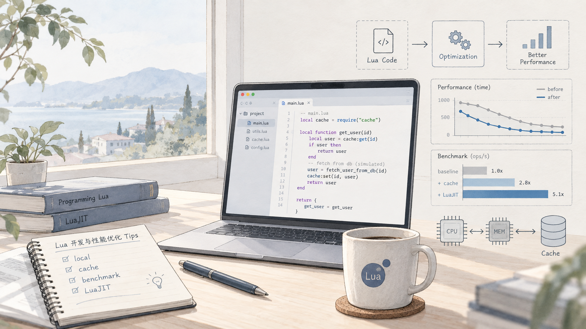

# Lua 性能技巧：局部变量、Table 和字符串遍历



<hr/>

前几天翻到一篇以前写的 Lua 笔记，内容主要是局部变量、Table 和字符串遍历。当时记得很认真，还跑了几组性能测试。现在回头看，有些结论依然能用，有些已经缺少上下文，还有两处说得不太准确。

这类旧笔记挺容易留下一个问题：代码看起来还能跑，结论也像那么回事，于是很多年都不会再去确认。既然重新翻到了，我就按现在的理解整理一遍。

下面主要以 PUC-Lua 5.4 为参照。Lua 5.1、LuaJIT 和 OpenResty 里的实际表现可能不同，涉及性能的部分还是要以自己的运行环境为准。

## 局部变量这件事，没必要走极端

Lua 里没有显式声明为 `local` 的变量，默认会被当作全局变量。访问全局变量时，实际需要经过 `_ENV` 这个表；局部变量则可以直接从当前函数的栈槽里取。

所以在热点循环里，先把经常调用的函数保存到局部变量，通常会更省一点：

```lua
local sin = math.sin
local total = 0

for i = 1, 1000000 do
    total = total + sin(i)
end
```

如果直接写 `math.sin(i)`，每次循环都要再取一次 `math.sin`：

```lua
local total = 0

for i = 1, 1000000 do
    total = total + math.sin(i)
end
```

这个优化本身没什么问题，但以前很容易把它理解成所有函数都应该先缓存一遍。现在我不太推荐这么写。普通代码里到处都是 `local tostring = tostring`、`local insert = table.insert`，省下来的时间未必能测出来，阅读时倒是先要多找一层名字。

我更倾向于把它留在真正的热点路径里。循环次数很多，而且 profiling 结果也指向这里，再做缓存比较合理。LuaJIT 还可能在 JIT 编译后消掉一部分重复查找，不能直接套用 PUC-Lua 的测试结果。

另外还有一个容易忽略的语义差别。如果程序运行中会替换 `math.sin`，局部变量仍然指向替换前的函数。大部分项目不会这么做，但缓存并不只是写法变化，它也可能改变程序行为。

## Table 不是每插入一次就重新哈希

旧笔记里写过一句，每一次向 Table 插入数据，Lua 都会重新计算元素的位置。这个说法不对。

Lua 的 Table 一般包含数组部分和哈希部分。连续的正整数键更适合进入数组部分，其他键主要放在哈希部分。空间不够，或者需要重新调整两部分的布局时，Lua 才会扩容和重哈希，不是每写入一个元素都来一遍。

所以像下面这样顺序写入，本身就是很正常的用法：

```lua
local values = {}

for i = 1, 1000 do
    values[i] = i * i
end
```

如果数据创建时已经知道，直接用构造器当然更简单：

```lua
local colors = { "red", "green", "blue" }
```

我以前还记录过一种预分配技巧，先在 Table 里塞一批 `true`，再把它们逐个覆盖：

```lua
local values = { true, true, true }
values[1] = 10
values[2] = 20
values[3] = 30
```

这个写法可能减少小型固定列表创建过程中的扩容，但我现在不会把它当成通用建议。它不直观，中间状态还有一批真实的 `true`，而且标准 Lua 也没有承诺构造器一定按我们期待的方式预留容量。

如果真的很在意初始容量，Lua C API 提供了 `lua_createtable(L, narr, nrec)`。部分 LuaJIT 或 OpenResty 环境也有 `table.new`，不过它不是标准 Lua API，部署环境换了就不一定还能用。

平时向列表末尾追加数据，下面两种写法都很常见：

```lua
values[#values + 1] = value
```

```lua
table.insert(values, value)
```

第一种少一次函数调用，在很紧的循环里可能稍快。第二种读起来更直接。如果是向列表中间插入，`table.insert` 需要移动后面的元素，数据量大时这部分成本才更值得留意。

这里还有个小坑。只有没有空洞的序列才适合把 `#values` 当作长度。对于下面这种 Table，`#values` 不适合拿来统计元素数量：

```lua
local values = { 10, nil, 30 }
```

Lua 规范把 `#` 定义为返回 Table 的一个边界。存在空洞时，边界可能不止一个，具体结果和内部表示有关。这个设计第一次看多少有点反直觉，但也说明了 Table 并不等同于传统意义上的数组。

## 清空 Table 之前，先看看还有谁拿着它

删除 Table 里的所有内容，最常见的写法是逐个把已有键设为 `nil`：

```lua
local function clear(t)
    for key in next, t do
        t[key] = nil
    end
end
```

这里直接使用 `next`，不会受 `__pairs` 元方法影响。Lua 允许遍历时删除当前已有的字段，不过不要一边遍历一边随意新增键，那样的行为没有可靠保证。

如果没有其他地方引用这个 Table，直接创建一个新的通常更省事：

```lua
values = {}
```

两种写法看起来都叫清空，实际并不是一回事：

```lua
local a = { 1, 2, 3 }
local b = a

a = {}

print(#a) -- 0
print(#b) -- 3
```

`a = {}` 只是让 `a` 指向新对象，`b` 仍然拿着原来的 Table。如果调用的是 `clear(a)`，`a` 和 `b` 看到的内容都会被删除。

所以这里先考虑引用关系，比纠结哪种写法更快重要。原地清空也不代表已经申请的内部容量一定马上释放；换成新 Table，则要等垃圾回收器处理旧对象。

## 字符串遍历，先弄清楚在遍历什么

旧文章里问题最大的是这一段。

当时列了五种遍历字符串的方法，还给出了耗时对比。后来重新看代码才发现，第一个版本根本不是逐字符读取：

```lua
for i = 1, #str do
    local ch = string.sub(str, i)
end
```

`string.sub(str, i)` 返回的是从第 `i` 个字节一直到末尾的整个后缀。循环越往前，创建的临时字符串越长。它不仅做错了事，性能测试也就没有比较价值了。

如果目标是取单个字节对应的字符串，应该同时传入起止位置：

```lua
local sub = string.sub

for i = 1, #str do
    local ch = sub(str, i, i)
end
```

不过在改代码之前，还得先回答一个问题：这里说的字符，到底指字节、Unicode 码点，还是用户眼里看到的一个完整字符？

ASCII 文本里这几件事看起来差不多。换成中文、组合音标或者 Emoji，差别很快就出来了。

### 处理的是字节

如果是在解析二进制协议、计算校验值，或者明确只处理 ASCII，直接读取字节比较合适：

```lua
local byte = string.byte

for i = 1, #str do
    local value = byte(str, i)
    -- value 是 0 到 255 的整数
end
```

如果后面的逻辑需要长度为 1 的字符串，可以使用前面的 `string.sub(str, i, i)`。也可以写成：

```lua
for ch in str:gmatch(".") do
    -- ch 是单字节字符串
end
```

后一种更直观，但会创建迭代器和子字符串。是否值得为了那点开销改成索引循环，还是看真实测试。

还有一种旧写法，是一次把所有字节塞进 Table：

```lua
local bytes = { string.byte(str, 1, #str) }
```

短字符串里它可以工作，但不适合当作长字符串的常规遍历方法。它会一次产生大量返回值，再创建一个 Table 保存结果，内存开销明显更大。字符串足够长时，还可能碰到栈或返回值数量的限制。

### 处理的是 UTF-8 码点

从 Lua 5.3 开始，标准库提供了基础的 UTF-8 支持。需要遍历码点时，可以用 `utf8.codes`：

```lua
local text = "Lua 与世界 🌍"

for byte_pos, codepoint in utf8.codes(text) do
    local ch = utf8.char(codepoint)
    print(byte_pos, codepoint, ch)
end
```

`byte_pos` 是这个码点在原字符串中的字节位置，`codepoint` 是码点数值。如果只想取出每段 UTF-8 编码，也可以使用 `utf8.charpattern`：

```lua
for ch in text:gmatch(utf8.charpattern) do
    print(ch)
end
```

这里有几件事要记住。`#text` 返回的是字节数，`string.sub` 使用的也是字节位置。`utf8.codes` 遇到非法 UTF-8 序列会报错，处理外部输入时不能默认数据永远正确。

标准 `utf8` 库解决的是编码和码点问题，并不负责 Unicode 规范化、字符分类和字素簇切分。某些 Emoji、带肤色修饰符的符号和组合音标，一个看得见的字符可能由多个码点组成。

如果需求是限制昵称长度、移动编辑器光标或者删除一个可见字符，只按 `utf8.codes` 遍历仍然不够。这时需要能处理 Unicode 字素簇的库，自己用几条规则拼一个版本，后面大概率还会补坑。

## 那几组旧性能数据为什么删了

旧文章里的测试结果看起来很具体，精确到小数点后三位。但几个版本做的事情其实不同：有的返回字符串后缀，有的创建单字节字符串，有的得到整数，还有的先分配整个 Table 再把整数转回字符串。

工作都不一样，耗时排个名也说明不了什么。数字写得越精确，反而越容易让人忽略这个问题。

真要测试，我觉得至少要守住几个基本条件：所有实现产生相同结果，测试数据接近真实输入，记录 Lua 版本和是否启用 JIT，而且不能只跑一次。`print` 和文件 I/O 也不要放进测试循环，不然最后测到的可能主要是终端。

可以用一个很小的框架先把测试搭起来：

```lua
local clock = os.clock

local function benchmark(name, rounds, fn)
    collectgarbage("collect")

    for _ = 1, 10 do
        fn()
    end

    local started = clock()
    local checksum = 0

    for _ = 1, rounds do
        checksum = checksum + fn()
    end

    local elapsed = clock() - started
    print(string.format(
        "%-16s %.6f s  checksum=%d",
        name,
        elapsed,
        checksum
    ))
end
```

这里保留 `checksum`，一方面可以核对不同实现的结果，另一方面也能避免某些运行环境把没有使用的计算直接优化掉。正式测试还要多跑几轮，看中位数和波动情况。单次结果刚好快了 15%，很可能只是那一轮垃圾回收比较给面子。

## 顺手再补两个常用的小技巧

大量拼接字符串时，反复写 `result = result .. part` 会不断产生中间字符串。片段比较多的话，先收集起来再用 `table.concat` 通常更合适：

```lua
local parts = {}

for i = 1, 1000 do
    parts[i] = tostring(i)
end

local result = table.concat(parts, ",")
```

遍历连续整数序列时，我一般直接用数值 `for`：

```lua
for i = 1, #values do
    local value = values[i]
end
```

需要键和值时再用 `pairs`。`pairs` 的顺序不应该被依赖，如果业务逻辑需要稳定顺序，就明确维护一份顺序数据，或者在使用前排序。指望哈希表每次刚好按同一个顺序出来，属于给以后的自己留惊喜。

## 最后再说两句

重新整理这篇旧文，最明显的感受不是 Lua 这些年变了多少，而是性能结论真的很容易脱离语义。代码跑得快不快当然重要，但它到底做了什么，往往更应该先确认。

局部变量、Table 扩容、字符串遍历这些都不算复杂。真正容易踩坑的地方，是记住了某个技巧，却忘了它成立的环境和前提。

这次先把几个明显的问题改掉。以后再看到带着精确百分比的性能技巧，我大概会先找测试代码，而不是先记结论。

## 参考资料

- [Lua 5.4 Reference Manual](https://www.lua.org/manual/5.4/manual.html)
- [Lua 5.4 源码中的 Table 实现](https://www.lua.org/source/5.4/ltable.c.html)
- [Lua Performance Tips](https://www.lua.org/gems/sample.pdf)

