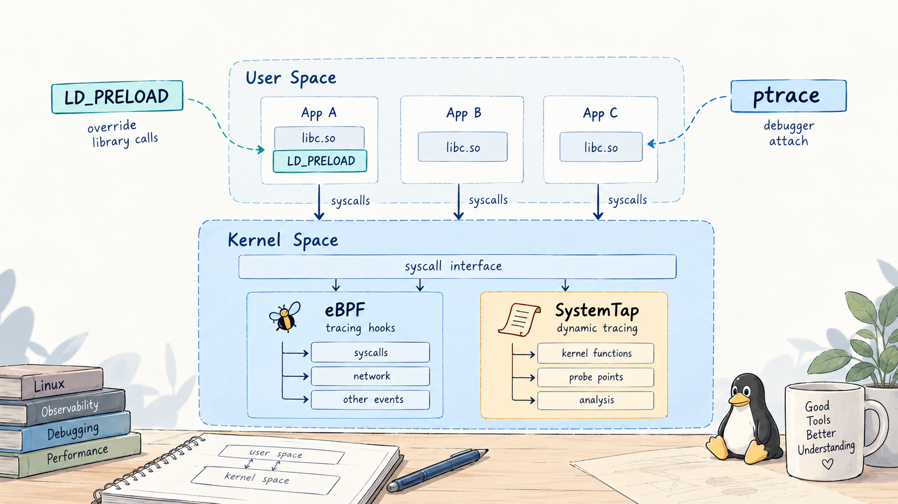

# 再看 eBPF、LDPRELOAD、ptrace 和 SystemTap



前段时间翻到一篇很早以前写的学习笔记，里面把 eBPF、`LD_PRELOAD`、`ptrace` 和 SystemTap 放在一起讲。方向不能说错，它们确实都能用来观察甚至改变程序行为，但现在再看，很多地方说得太轻巧了。

比如，`LD_PRELOAD` 拦截到的 `open()`，和 `strace` 里看到的 `openat()` 到底是不是一回事？eBPF 既能跟踪系统调用，又能在 XDP 里处理数据包，它到底算跟踪工具还是内核扩展机制？SystemTap 是不是每次都要编译并加载内核模块？还有那个流传很久的说法，eBPF 程序最多只能有 4096 条指令，现在还对不对？

这些问题单独查都不难，放在一起反而容易乱。原因是四种技术虽然经常出现在同一类文章里，实际下手的位置完全不同。把它们只按优缺点做成四张卡片，看完大概还是不知道遇到问题该用谁。

这次想换个方式，从一个很普通的文件打开操作开始，顺着程序真正走过的路径看下去。

## 先把它们放回正确的位置

一个动态链接的 Linux 程序调用 `open()`，粗略看会经过下面这些层次：

```text
应用代码
  |
  | 调用 open() 符号
  v
动态链接器和 libc                 <- LD_PRELOAD 在这里截获函数调用
  |
  | 发起 openat 等系统调用
  v
系统调用边界                      <- ptrace 可在 syscall-stop 停住线程
  |
  v
Linux 内核
  |  tracepoint / kprobe / fentry  <- eBPF 或 SystemTap 可在这里观测
  |  LSM / cgroup / XDP 等 hook    <- 部分 eBPF 程序还能作出策略决定
  v
VFS、文件系统、驱动或网络栈
```

这张图省略了不少细节，但已经能解释大部分误会。

`LD_PRELOAD` 替换的是用户空间的动态符号。它能看见调用者传给 libc 包装函数的参数，也能改参数、伪造返回值，甚至完全不调用原函数。代价是它只能覆盖真正经过该符号解析路径的调用。

`ptrace` 控制的是一个个线程。跟踪器可以让被跟踪线程在系统调用入口、出口、信号递送或断点处停下来，再检查寄存器和内存。它看得细，也确实能改，但每次停顿都需要内核协调跟踪器和被跟踪线程。

eBPF 是内核提供的受约束可编程机制。跟踪只是它的一部分用途，程序还可以挂到网络、cgroup、LSM 等 hook 上。代码先经过验证器检查，再由解释器或 JIT 执行，并通过 map、ring buffer 等设施保存或送出数据。

SystemTap 更像一门动态探测语言加一套工具链。它用 tapset 把不少底层探针包装成较稳定、较好写的事件。默认内核 runtime 会把脚本翻译成 C，再编译成内核模块；现在也有 `dyninst` 和 `bpf` runtime，但支持范围和默认 runtime 并不完全相同。SystemTap 的 [`stap(1)` 手册](https://sourceware.org/systemtap/man/stap.1.html) 对这三种 runtime 的区别写得很清楚。

先给一个不追求绝对精确、但实际选工具时很好用的表：

| 技术 | 主要落点 | 能否改行为 | 对目标程序的要求 | 常见粒度 | 更像什么 |
| --- | --- | --- | --- | --- | --- |
| `LD_PRELOAD` | 动态链接和库函数调用 | 很容易 | 动态链接，且调用经过可插桩符号 | 函数调用 | 进程内代理层 |
| `ptrace` | 线程执行、寄存器、内存、系统调用边界 | 可以 | 需要满足 ptrace 权限检查 | 指令、信号、系统调用 | 外部调试器 |
| eBPF | 内核提供的各种 hook | 取决于程序类型和 hook | 内核特性、权限、BTF 等条件 | 事件、函数、包、策略 hook | 受约束的内核扩展机制 |
| SystemTap | kprobe、uprobe、tracepoint、tapset 等 | 默认以观测为主，guru 模式能力更激进 | 工具链、调试信息和权限随探针而变 | 事件和脚本化聚合 | 动态探测语言与框架 |

这里最容易犯的错误，是把能看到事件等同于能可靠阻止事件。系统调用入口 tracepoint 能告诉我们某线程打算调用什么，但它不是天然的访问控制点。真要做策略执行，应该找有明确返回语义的 hook，例如 LSM、cgroup 或网络路径中的相应 eBPF 程序类型，而不是在观测探针里硬拗。

## 用同一个小程序试四遍

下面准备一个故意写得很简单的目标程序。它先读取 `/etc/hostname`，再创建 `/tmp/hook-lab.txt`。

```c
// victim.c
#include <fcntl.h>
#include <stdio.h>
#include <unistd.h>

int main(void)
{
    char buf[64] = {0};

    int in = open("/etc/hostname", O_RDONLY);
    if (in == -1) {
        perror("open /etc/hostname");
        return 1;
    }

    ssize_t n = read(in, buf, sizeof(buf) - 1);
    if (n > 0)
        printf("hostname: %s", buf);
    close(in);

    int out = open("/tmp/hook-lab.txt",
                   O_WRONLY | O_CREAT | O_TRUNC,
                   0644);
    if (out == -1) {
        perror("open output");
        return 1;
    }

    write(out, "hello\n", 6);
    close(out);
    return 0;
}
```

编译时先关闭优化，避免这个教学例子里出现没必要的干扰：

```bash
gcc -O0 -g -Wall -Wextra -o victim victim.c
./victim
```

以下命令以常见的 x86_64 Linux 发行版为背景。探针名、软件包名、权限策略会随发行版、架构和内核配置变化，真正运行前最好先列出本机可用事件。这里不把某台机器上的输出冒充成所有环境都一样。

## `LD_PRELOAD`：在程序还没进内核前换掉函数

ELF 动态链接器加载程序时，会解析它依赖的共享对象和符号。`LD_PRELOAD` 指定的共享对象会优先加入 link map，因此其中同名的全局符号可以抢在 libc 实现之前被解析到。glibc 动态链接器的 [`ld.so(8)` 手册](https://man7.org/linux/man-pages/man8/ld.so.8.html) 把加载顺序、`LD_PRELOAD` 和 secure-execution mode 的处理都列了出来。

一个相对完整的 `open()` 包装器如下：

```c
// hook_open.c
#define _GNU_SOURCE
#include <dlfcn.h>
#include <errno.h>
#include <fcntl.h>
#include <stdarg.h>
#include <stdio.h>
#include <sys/stat.h>
#include <sys/syscall.h>
#include <unistd.h>

typedef int (*open_fn)(const char *, int, ...);

int open(const char *path, int flags, ...)
{
    static open_fn next_open;
    mode_t mode = 0;
    int needs_mode = (flags & O_CREAT) ||
                     ((flags & O_TMPFILE) == O_TMPFILE);

    if (needs_mode) {
        va_list ap;
        va_start(ap, flags);
        mode = va_arg(ap, mode_t);
        va_end(ap);
    }

    if (!next_open) {
        dlerror();
        *(void **)(&next_open) = dlsym(RTLD_NEXT, "open");
        const char *err = dlerror();
        if (err) {
            syscall(SYS_write, STDERR_FILENO, err, __builtin_strlen(err));
            syscall(SYS_write, STDERR_FILENO, "\n", 1);
            errno = ENOSYS;
            return -1;
        }
    }

    char line[512];
    int len = snprintf(line, sizeof(line),
                       "[preload] pid=%ld open(%s, %#x, %#o)\n",
                       (long)getpid(), path, flags, mode);
    if (len > 0) {
        size_t size = (size_t)len < sizeof(line) ? (size_t)len
                                                 : sizeof(line) - 1;
        syscall(SYS_write, STDERR_FILENO, line, size);
    }

    int fd;
    if (needs_mode)
        fd = next_open(path, flags, mode);
    else
        fd = next_open(path, flags);

    return fd;
}
```

编译并运行：

```bash
gcc -shared -fPIC -Wall -Wextra -o hook_open.so hook_open.c -ldl
LD_PRELOAD="$PWD/hook_open.so" ./victim
```

正常情况下会看到两条 `[preload]` 日志。这里有几个细节，比示例本身更重要。

### `open()` 是可变参数函数

只有设置 `O_CREAT` 或 `O_TMPFILE` 时，第三个 `mode` 参数才必须存在。原来的简化写法把函数声明成固定两个参数，随后也只用两个参数调用真实 `open()`。一旦目标程序创建文件，文件权限参数就丢了，行为属于未定义范围。

[`open(2)`](https://man7.org/linux/man-pages/man2/open.2.html) 明确写了：使用 `O_CREAT` 或 `O_TMPFILE` 时必须提供 `mode`，否则栈上的任意字节可能被当成文件模式。写 hook 时，函数 ABI 不是差不多就行，必须完全对上。

### `RTLD_NEXT` 不是获得 libc 地址的魔法

`dlsym(RTLD_NEXT, "open")` 的准确含义，是从当前共享对象之后继续寻找下一个同名符号。它很适合包装函数，但如果同时加载了多个 preload 库，下一个实现未必直接来自 libc。这个语义可以在 [`dlsym(3)`](https://man7.org/linux/man-pages/man3/dlsym.3.html) 里确认。

初始化也有递归风险。`dlsym()`、日志函数、内存分配器都可能间接触发另一个被 hook 的函数。上面的例子特意用 `SYS_write` 输出，避免日志路径再次调用 `open()`，但它依然只是教学代码。真要做长期运行的插桩库，还要考虑线程安全、构造阶段、符号版本、`fork()` 后状态、异步信号安全以及多个 hook 之间的递归。

### 拦住 `open()` 不等于拦住文件打开

程序可能调用 `openat()`、`openat2()`、`fopen()`、`open64()`，也可能直接发起系统调用。编译器还可能做内联或内部别名调用，glibc 自己的内部调用也不保证经过可被外部符号抢占的 PLT 项。

所以 `LD_PRELOAD` 非常适合这些事情：

* 给自己控制的动态链接程序快速加日志、故障注入或兼容层。
* 在测试中替换时间、随机数、分配器或文件接口。
* 对明确的库 API 做行为实验。

它不适合被当成完整的安全边界。静态链接程序、直接系统调用、换一个 API 或清理环境变量，都可能绕开它。对于触发 secure-execution mode 的程序，动态链接器还会忽略或严格限制相关环境变量。`/etc/ld.so.preload` 是系统级机制，影响面很大，也不该拿来随手实验。

我的习惯是，只要目标是观测自己的单个进程，而且要看到库函数语义，先考虑 `LD_PRELOAD`。如果目标是证明系统里所有文件访问都被覆盖，它通常不是答案。

## `ptrace`：让另一个线程停下来，把现场交给跟踪器

`ptrace` 的基本模型不是一个进程附加到另一个进程，而是一个 tracer 控制一个个 tracee 线程。Linux 的 [`ptrace(2)`](https://man7.org/linux/man-pages/man2/ptrace.2.html) 特别强调，附加和后续命令都是 per-thread 的，多线程进程里的每个线程可以分别被附加，甚至可以有不同的 tracer。

这也修正了一个常见说法：`ptrace` 不是不能跟踪多线程程序，而是跟踪器必须正确处理线程创建、每个 TID 的 stop 状态，以及 `waitpid()` 返回的各种事件。实现起来麻烦，和做不到不是一回事。

### 先用 `strace` 看实际系统调用

对这个实验程序，最省事的方式是：

```bash
strace -f -e trace=%file -yy ./victim
```

`%file` 是 strace 提供的系统调用集合，覆盖打开、查询属性、改名等文件路径相关调用。`-f` 跟踪后来创建的线程或子进程，`-yy` 尽量补充文件描述符指向的信息。当前选项以 [`strace(1)`](https://man7.org/linux/man-pages/man1/strace.1.html) 为准。

输出里大概率看到的不是 `open()`，而是 `openat()`：

```text
openat(AT_FDCWD, "/etc/hostname", O_RDONLY) = 3</etc/hostname>
openat(AT_FDCWD, "/tmp/hook-lab.txt", O_WRONLY|O_CREAT|O_TRUNC, 0644) = 3</tmp/hook-lab.txt>
```

准确的文件描述符和前置加载记录会因环境不同。这一现象说明，源代码里的 libc API 名称，不必等于真正进入内核的系统调用名。glibc 可以用 `openat()` 实现 `open()` 的语义。`LD_PRELOAD` 看的是用户空间 API，strace 看的是系统调用边界，两边输出不同并不矛盾。

### syscall-stop 里发生了什么

跟踪器使用 `PTRACE_SYSCALL` 恢复 tracee 后，内核会让该线程在下一次系统调用入口或出口再次停住。跟踪器通过 `waitpid()` 收到状态，再读取寄存器判断系统调用号、参数和返回值。设置 `PTRACE_O_TRACESYSGOOD` 后，系统调用 stop 可与普通 `SIGTRAP` 更容易地区分。

这套机制的优势很直接：

* 不依赖目标程序是否动态链接。
* 能读写寄存器和目标内存。
* 能观察系统调用的入口和返回结果。
* 能处理断点、单步、信号、`execve()`、`clone()` 等执行事件。

代价同样直接。频繁系统调用会频繁触发 stop、唤醒 tracer、读取状态再恢复 tracee。这个过程不是简单地在原执行流里加一个函数调用，而是引入调度和用户态往返。调试时通常可以接受，给高吞吐服务长期全量跟踪就要非常谨慎。

新版 strace 还有 `--seccomp-bpf` 选项，可以让 seccomp BPF 先筛选感兴趣的系统调用，减少不相关的 ptrace stop，但这没有把 strace 变成普通的 eBPF 跟踪器。最终选中的调用仍然要走 ptrace 处理，具体限制也应看本机 strace 手册。

### 权限不是非 root 一律不行

同一用户、父子关系、进程是否 dumpable、凭据、user namespace、`CAP_SYS_PTRACE` 和 LSM 都会参与判断。启用 Yama 的系统还会通过 `/proc/sys/kernel/yama/ptrace_scope` 进一步收紧附加规则。

所以最准确的描述不是 ptrace 必须 root，而是它必须通过内核的 ptrace access mode 检查以及可能存在的 LSM 限制。`CAP_SYS_PTRACE` 可以允许跟踪任意目标，但普通用户也常常可以跟踪自己启动的子进程。容器里即使显示为 root，也不代表拥有宿主目标所在 user namespace 中的相应能力。

`ptrace` 很适合调试器、崩溃分析、逆向和一次性系统调用排查。要做低侵入、全系统、长期观测，我一般不会先选它。

## eBPF：不是一个工具，而是一套内核可编程机制

以前介绍 eBPF，常见的流程是写受限 C、LLVM 编译、验证器检查、JIT 执行、map 传数据。这个流程作为入门没有问题，但容易留下两个错觉。

一个错觉是 eBPF 只有一种程序。实际上，挂在 XDP、tc、tracepoint、kprobe、cgroup、socket filter 和 LSM 上的程序，输入上下文、可调用 helper、返回值意义和权限要求都不同。eBPF 的能力首先由 program type 和 attach type 决定，不是写了同一种 C 就什么都能做。

另一个错觉是验证器负责证明程序绝对正确。它真正做的是检查内核规定的一组安全条件，例如寄存器和指针类型、越界访问、栈状态、helper 参数，以及控制流是否能被分析。业务逻辑写错、统计口径错、事件丢失和竞态，并不会因为通过验证器就自动消失。

### 从源码到运行，大致经过什么

以 libbpf 的 CO-RE 程序为例，通常有这些对象和阶段：

1. Clang 把带 `SEC()` 标记的 BPF C 编译成 ELF 对象，其中包含 BPF 指令、map 定义、BTF 和重定位信息。
2. 用户空间 loader 打开对象，创建 map，处理重定位，再通过 `bpf()` 系统调用请求内核加载程序。
3. 验证器对程序做路径和状态分析。不接受的程序在这里返回 verifier log。
4. 内核解释或 JIT 编译程序，并把它附加到指定 hook。
5. 事件发生时，程序在对应上下文中运行，更新 map 或把事件写入 ring buffer。
6. 用户空间消费数据。链接和文件描述符被关闭后，对象通常随引用消失；需要跨进程持久化时可以 pin 到 bpffs。

Linux 内核的 [libbpf 概览](https://docs.kernel.org/bpf/libbpf/libbpf_overview.html) 对 open、load、attach 和 tear down 四个阶段有完整说明。CO-RE 依赖 BTF 描述目标内核类型，再在加载时修正字段偏移。它解决了相当一部分跨内核结构差异，但不是一句编译一次就保证运行在所有 Linux 上。目标内核仍然要具备所需 program type、helper、kfunc、map 类型和 BTF 信息。

### map 不只是用户态通信管道

BPF map 是由内核管理的对象，可以被 BPF 程序和用户空间访问。hash、array、per-CPU map、LRU hash、stack trace、ring buffer、sockmap、devmap 各有不同语义。内核的 [BPF maps 文档](https://docs.kernel.org/bpf/maps.html) 给出了当前 map 类型和 syscall 接口。

观测程序常见的两种数据路径是：

* 在 map 内直接聚合，例如按 PID 统计次数、按延迟区间做直方图。事件再多，用户空间拿到的也只是聚合结果。
* 把每个事件送进 perf buffer 或 BPF ring buffer，由用户空间逐条消费。

第二种方式更灵活，也更容易把消费者打爆。BPF ring buffer 空间不足时，reserve 会失败而不是阻塞等待。生产代码应该显式统计丢失，而不是默认日志没出现就代表事件没发生。内核的 [BPF ring buffer 设计文档](https://docs.kernel.org/bpf/ringbuf.html) 说明了 reserve、commit、discard 和通知行为。

### 验证器限制已经不是 4096 条指令和禁止循环

4096 条指令曾经是很醒目的限制，但把它当成所有现代 eBPF 程序的统一上限已经不准确。内核 [BPF Design Q&A](https://docs.kernel.org/bpf/bpf_design_QA.html) 区分了非特权程序的 `BPF_MAXINSNS` 和验证器内部的复杂度限制。验证器探索指令的上限、分支数量、状态数量、调用深度等约束仍然存在，复杂程序照样可能被拒绝。

有界循环也早已得到支持。麻烦之处从不允许写循环，变成验证器必须能证明边界，并承担循环展开路径带来的复杂度。边界取值很大、循环体分支很多时，源码看起来不长，验证状态却可能快速膨胀。

所以遇到 verifier 拒绝，第一反应不该只是删到 4096 条以内。先看完整 verifier log，确认是指针状态、边界、未初始化值还是路径复杂度，再决定拆 tail call、改数据结构、收紧循环界限或换 helper。

### 用 bpftrace 观察实验程序

如果目标只是回答谁在打开什么文件，没必要一上来就搭完整 libbpf 工程。bpftrace 更合适：

```bash
sudo bpftrace -e '
tracepoint:syscalls:sys_enter_openat
/pid == cpid/
{
  printf("enter pid=%d comm=%s path=%s flags=0x%x\n",
         pid, comm, str(args.filename), args.flags);
}

tracepoint:syscalls:sys_exit_openat
/pid == cpid/
{
  printf("exit  pid=%d ret=%d\n", pid, args.ret);
}' -c './victim'
```

`-c` 启动子进程，`cpid` 是 bpftrace 暴露的子进程 PID。需要注意，bpftrace 对普通 tracepoint 不会因为使用了 `-c` 就自动加 PID 过滤，所以脚本里仍然写了 `/pid == cpid/`。这个细节在 [bpftrace 0.25 命令行文档](https://bpftrace.org/docs/release_025/cli) 中有明确说明。

运行前最好先确认本机事件字段：

```bash
sudo bpftrace -lv 'tracepoint:syscalls:sys_enter_openat'
sudo bpftrace -lv 'tracepoint:syscalls:sys_exit_openat'
```

这里同时挂入口和出口，是因为入口只能看到请求参数，出口的 `ret` 才告诉我们是否成功。若要计算单次延迟，可以在入口用 `tid` 保存 `nsecs`，出口相减后删除 map 项：

```bpftrace
tracepoint:syscalls:sys_enter_openat
/pid == cpid/
{
  @start[tid] = nsecs;
}

tracepoint:syscalls:sys_exit_openat
/@start[tid]/
{
  @latency_us = hist((nsecs - @start[tid]) / 1000);
  delete(@start[tid]);
}
```

键要用 `tid` 而不是只用 `pid`。同一进程的多个线程可以并发进入同一种系统调用，只按进程保存开始时间会互相覆盖。

### tracepoint、kprobe、fentry 和 uprobe 怎么选

只说 eBPF 可以挂系统调用和函数还不够，探针本身也有稳定性差异。

* tracepoint 是内核显式定义的静态事件，字段可从 tracefs 的 `format` 文件查看。做跨版本观测时通常优先考虑。
* kprobe 可以动态挂到大量内核指令或函数，覆盖面广，但内核内部函数名、参数和内联情况不是稳定 ABI。内核升级后需要重新验证。
* fentry/fexit 基于 BTF 提供更直接的函数入口和出口上下文，合适时通常比传统 kprobe 更自然，但依赖内核和 BTF 支持。
* uprobe/uretprobe 挂用户空间 ELF 的文件偏移或符号。它不要求修改目标源码，但二进制升级、符号剥离、ASLR 处理和 ABI 变化都要考虑。
* USDT 是应用显式提供的用户空间静态探针，语义通常比随便找一个内部函数更稳定，但前提是应用埋了探针。

[bpftrace 探针参考](https://bpftrace.org/docs/release_025/cli#probes) 汇总了常用 probe 类型。内核的 [Kprobes 文档](https://docs.kernel.org/trace/kprobes.html) 还解释了断点、单步和优化探针的底层过程；[Uprobe tracer 文档](https://docs.kernel.org/trace/uprobetracer.html) 则描述了用户空间探针的格式和参数获取。

### eBPF 也不是天然低开销

不把每次事件送到另一个用户进程停住，确实是 eBPF 跟踪相对 ptrace 的重要优势。但低开销不是免费的保证。

在每秒触发数百万次的 hook 上读取多层结构、抓用户栈、拼字符串，再把每条事件送到用户空间，照样会产生明显成本，甚至丢事件。更实际的做法通常是尽早过滤、在内核侧聚合、限制采样频率、统计丢失，并用压测验证对目标工作负载的影响。

权限也不是一句需要 root 能概括的。现代内核把部分能力拆分为 `CAP_BPF`、`CAP_PERFMON`、`CAP_NET_ADMIN` 等，不同程序类型组合不同；发行版还可能禁用非特权 BPF。[`capabilities(7)`](https://man7.org/linux/man-pages/man7/capabilities.7.html) 记录了 `CAP_BPF` 和 `CAP_PERFMON` 的职责。容器中的 capability、seccomp、LSM、只读 tracefs 和宿主内核配置还会继续影响结果。

## SystemTap：把探针、数据和聚合写进一门语言

SystemTap 和 eBPF 经常被写成竞争关系，其实这个比较有点错位。eBPF 是内核机制，SystemTap 是一套动态探测系统。SystemTap 可以使用 kprobe、uprobe、tracepoint 等设施，默认生成内核模块，也提供实验性质或受限的 BPF runtime。两者可以在底层相遇，但抽象层并不相同。

SystemTap 脚本最吸引人的地方，是事件加处理器的表达方式，以及 tapset 帮忙隐藏的一部分版本差异：

```stap
probe syscall.openat {
    if (pid() == target()) {
        printf("enter pid=%d comm=%s path=%s flags=%s\n",
               pid(), execname(), filename, flags_str)
    }
}

probe syscall.openat.return {
    if (pid() == target()) {
        printf("exit  pid=%d ret=%d\n", pid(), ret)
    }
}
```

保存为 `openat.stp` 后可以让 SystemTap 启动目标程序：

```bash
sudo stap -c './victim' openat.stp
```

`-c` 对应的进程可由 `target()` 取得。`syscall.openat` tapset 提供 `filename`、`flags_str`、`mode` 等便利变量，返回探针提供 `ret`。变量名称应以本机 tapset 为准，可以先查看脚本最终会解析到哪些探针：

```bash
stap -L 'syscall.openat'
stap -L 'syscall.openat.return'
```

SystemTap 的 [syscalls tapset 参考](https://sourceware.org/systemtap/tapsets/syscalls.html) 列出了这些变量。相比直接从寄存器取参数，tapset 的价值就是替脚本作者吸收一部分架构和内核版本差异。

### 默认 runtime 到底做了什么

默认流程大致是：

1. 解析脚本，展开 tapset 别名并做语义检查。
2. 生成 C 代码。
3. 针对目标内核编译内核模块。
4. 由 `staprun` 加载模块并启用探针。
5. 探针触发时在内核上下文执行处理器。
6. 会话结束后禁用探针并卸载模块。

这也是 SystemTap 经常要求匹配内核的开发包和调试信息的原因。不同发行版可能使用 debuginfod、独立 debuginfo 包或预先编译的模块来缓解部署问题。缺什么取决于探针，简单 tracepoint 和读取函数局部变量不是同一级别的需求。

SystemTap 当前还支持：

* `--runtime=dyninst`，针对用户进程做 Dyninst 插桩，不加载内核模块，但探针和语言功能受限。
* `--runtime=bpf`，把脚本编译成 eBPF 程序，同样只支持语言和探针的一个子集，官方手册仍把它描述为早期阶段的 backend。

所以默认编译内核模块依然是对经典 SystemTap 的正确描述，但写成 SystemTap 必然编译内核模块就过头了。

### SystemTap 擅长的是把分析逻辑靠近事件

SystemTap 有关联数组、统计聚合、定时器、函数、回溯和 tapset。做一次复杂的内核问题调查时，可以在脚本里把入口和出口关联起来，只输出直方图或异常样本，而不必把所有原始事件先倒进用户空间。

例如统计目标进程 `openat` 的延迟：

```stap
global started, latency

probe syscall.openat {
    if (pid() == target())
        started[tid()] = gettimeofday_ns()
}

probe syscall.openat.return {
    if (tid() in started) {
        latency <<< (gettimeofday_ns() - started[tid()]) / 1000
        delete started[tid()]
    }
}

probe end {
    println("openat latency in microseconds")
    print(@hist_log(latency))
}
```

这类脚本很能体现 SystemTap 的味道。不是把内核事件逐条打印出来，而是在事件发生的位置收集、关联和压缩数据。

但默认 runtime 最终是内核模块，能力大也意味着故障半径大。官方文档明确提醒，`stapdev` 权限实质上接近 root。生产环境里应该限制脚本来源和权限，先在匹配环境编译测试，设置输出和运行时间上限，避免在高频探针里做重活。guru 模式允许嵌入 C 或改变状态，除非确实知道自己在做什么，我不会把它当普通观测手段。

## 同一个问题，四种答案为什么不一样

回到最开始的实验，四种方法可能分别给出这样的结果：

| 观察方式 | 看到的名字 | 能看到什么 | 可能漏掉什么 |
| --- | --- | --- | --- |
| `LD_PRELOAD` hook `open` | `open()` | libc API 的原始参数，可直接改参数和结果 | `openat`、直接 syscall、静态链接、其他进程 |
| strace | `openat()` | syscall 参数、返回值、错误码、信号和线程事件 | 系统调用内部细节，长期全量成本较高 |
| bpftrace tracepoint | `sys_enter_openat`、`sys_exit_openat` | 全系统或按条件过滤的内核事件，可低成本聚合 | 用户空间函数语义，未挂载路径，丢失的 buffer 事件 |
| SystemTap syscall tapset | `syscall.openat` | tapset 转换后的参数、返回值、脚本内聚合 | 取决于 tapset、调试信息、runtime 和本机配置 |

这不是谁更真实的问题。它们观察的是同一条执行路径上的不同层。

如果程序调用 `fopen()`，`LD_PRELOAD` hook `fopen` 能拿到 `FILE *` 这一层的语义；系统调用跟踪最终只会看到底层的 `openat`、`read`、`mmap` 等。如果某个文件从程序启动前就已经打开，四种方法临时附加后都不会凭空重放历史。若路径在进入内核后经历符号链接、挂载 namespace 或文件系统解析，入口处的字符串也不等于最终 inode 身份。

把这些层次分开，很多似乎互相矛盾的现象就不奇怪了。

## 放到安全检测里，事情会更麻烦一点

这些技术确实都能用于安全分析，但旧文章里那种只要监控系统调用就能做入侵检测的说法，多少有点乐观。

### 观测点不等于安全边界

拿文件访问来说，`sys_enter_openat` 能得到用户传入的路径字符串，但路径可以是相对路径，解析依赖当前工作目录、dirfd、mount namespace、符号链接和竞态。入口事件发生时操作还没完成，出口返回 0 以上也只代表拿到了文件描述符，不自动说明最终对象符合字符串直觉。

如果需求是审计，可以记录入口、出口、进程身份、namespace 和必要的内核对象信息，再在用户空间关联。如果需求是阻止访问，应该使用为访问控制设计的 LSM 等 hook。Linux 支持把 eBPF 程序附加到 LSM hook，官方的 [BPF LSM 文档](https://docs.kernel.org/bpf/prog_lsm.html) 给出了 `file_mprotect` 示例和 attach 方式。

### 单个事件往往没有足够语义

一次 `execve()`、一次 `connect()` 或一次 `mprotect()` 很少能单独证明恶意。更有用的是受约束的事件链，例如：

外部可写目录创建文件 -> 文件变为可执行或被解释器加载  -> 新进程连接异常目的地址  -> 随后访问敏感凭据路径


真正实现时还要处理 PID 复用、线程与进程的区别、容器 PID namespace、进程启动时间、事件乱序和丢失。只用 PID 当永久身份，会在长时间运行后踩坑。至少应把 PID 与启动时间或内核可用的稳定标识组合，并对 fork、exec、exit 建立生命周期状态。

### 攻击者和检测器可能在同一信任域

`LD_PRELOAD` 库运行在目标进程地址空间里，目标若不可信，就可以检查、绕过甚至干扰它。ptrace tracer 能读目标内存，但附加行为可见，而且一个线程通常不能同时被多个 tracer 正常控制。eBPF 和 SystemTap 的探针位于更高权限层，但拥有足够宿主权限的攻击者也可能卸载程序、篡改策略或攻击数据消费者。

所以这些机制可以成为检测传感器，却不能自动解决传感器自身的信任问题。部署安全产品时，还需要最小权限、程序和配置完整性、事件通道保护、容量控制、降级策略以及对传感器健康状态的监控。

### 明文不是想抓就能抓

用 `LD_PRELOAD` hook `SSL_read` 或 `SSL_write` 的确可能在特定 OpenSSL 程序里看到加解密前后的数据，但它不是通用 TLS 观测方案。应用可能静态链接 OpenSSL、使用 BoringSSL、GnuTLS、Rustls、自带 TLS 栈，函数也可能被内联或符号不可见。uprobe 同样受二进制和 ABI 变化影响。

在自己拥有和授权的系统里排障，这种办法有价值。把它描述成企业环境里普适、可靠的加密流量审计能力，就说得太满了。

## 真正选工具时先问这些问题

### 我需要的是库函数语义，还是内核事实

想知道应用传给 `malloc()`、`SSL_write()` 或某个业务共享库的参数，优先看 `LD_PRELOAD`、uprobe、USDT 或语言自己的 profiler。想知道系统调用是否成功、网络包走到哪里、调度为何延迟，应该去内核侧找合适 hook。

### 目标是一个自己启动的进程，还是整台机器

单进程临时排查，strace 和 `LD_PRELOAD` 往往最快。整机长期观测更偏向 eBPF、perf、ftrace 或经过审慎部署的 SystemTap。不要为了显得现代，把十秒能用 strace 看清的问题改成一个 libbpf 项目。

### 需要观察，还是需要控制

只观察就尽量用只读、稳定、语义明确的探针。需要阻断时，找设计上允许返回策略结果的 hook。通过 kprobe 修改寄存器、SystemTap guru 模式或 ptrace 篡改 syscall，技术上可能做得到，但可维护性和安全性通常都不好。

### 能接受多大侵入和依赖

目标机器是否有 BTF、内核调试信息、编译工具、对应 capability？能不能重启？能不能给进程加环境变量？允许让目标线程频繁停止吗？这些现实条件往往比工具功能列表更早决定答案。

### 出问题时能不能证明自己没漏数据

任何长期观测系统都应该回答：

* ring buffer 满了丢多少？
* 探针附加失败会不会报警？
* 目标二进制升级后 uprobe 是否还有效？
* 内核升级后字段、函数和 helper 是否兼容？
* 用户空间消费者挂了，内核侧会怎样？
* 观测程序本身造成多少 CPU、内存和延迟开销？

没有这些指标，漂亮的事件流很容易给人一种全都看见了的错觉。

## 几个容易记错的结论

最后把这次重看时修正的几处认识集中放一下。

* eBPF 不只是跟踪框架。跟踪、网络处理、cgroup 策略和 LSM 都建立在同一套内核可编程机制上，但不同程序类型能力不同。
* 验证器不是通用正确性证明器。它保证的是内核定义的安全约束，不能保证统计逻辑和安全规则正确。
* 现代 eBPF 不能再简单概括成最多 4096 条指令、完全禁止循环。非特权限制和验证复杂度限制要分开看，有界循环也早已存在。
* `LD_PRELOAD` hook 库函数，不是 hook 系统调用。静态链接、直接 syscall、其他 API 和 secure-execution mode 都可能让它失效。
* `open()` 包装器必须正确处理可变参数。忽略 `O_CREAT` 和 `O_TMPFILE` 的 `mode` 不是简化，是 bug。
* ptrace 以线程为单位。多线程跟踪需要逐个处理 TID 和线程事件，但不是天然只能跟踪单线程。
* ptrace 权限不等于只有 root 才能用。父子关系、凭据、dumpable、user namespace、capability 和 Yama 都会影响结果。
* SystemTap 默认 runtime 会生成内核模块，但不是只有这一条路径。Dyninst 和 BPF runtime 存在，只是能力范围不同。
* 系统调用入口表示尝试，出口才有结果。做延迟或成功率分析时通常要关联 entry 和 exit。
* tracepoint 通常比内核内部函数名稳定，但稳定也不是永远不变。上线前仍应在目标内核检查事件格式。

我现在更愿意把这四种技术看成四个不同高度的观察窗，而不是四把可以互换的锤子。`LD_PRELOAD` 离应用语义最近，ptrace 对线程控制最细，eBPF 覆盖的内核 hook 最广，SystemTap 则把动态探测和聚合包装成了一门很有表达力的语言。

真遇到问题时，先确定自己想看哪一层，再决定用什么。很多时候答案仍然是先跑一遍 strace，而不是先写 200 行 BPF C。这个结论不够酷，但通常比较省时间。

## 参考资料

以下资料以官方文档和 Linux man-pages 为主，文中的版本相关结论也尽量以这些页面为准：

* [Linux kernel: libbpf Overview](https://docs.kernel.org/bpf/libbpf/libbpf_overview.html)
* [Linux kernel: BPF Design Q&A](https://docs.kernel.org/bpf/bpf_design_QA.html)
* [Linux kernel: BPF maps](https://docs.kernel.org/bpf/maps.html)
* [Linux kernel: BPF ring buffer](https://docs.kernel.org/bpf/ringbuf.html)
* [Linux kernel: LSM BPF Programs](https://docs.kernel.org/bpf/prog_lsm.html)
* [Linux kernel: Kernel Probes](https://docs.kernel.org/trace/kprobes.html)
* [Linux kernel: Uprobe tracer](https://docs.kernel.org/trace/uprobetracer.html)
* [Linux man-pages: ld.so(8)](https://man7.org/linux/man-pages/man8/ld.so.8.html)
* [Linux man-pages: dlsym(3)](https://man7.org/linux/man-pages/man3/dlsym.3.html)
* [Linux man-pages: open(2)](https://man7.org/linux/man-pages/man2/open.2.html)
* [Linux man-pages: ptrace(2)](https://man7.org/linux/man-pages/man2/ptrace.2.html)
* [Linux man-pages: capabilities(7)](https://man7.org/linux/man-pages/man7/capabilities.7.html)
* [Linux man-pages: strace(1)](https://man7.org/linux/man-pages/man1/strace.1.html)
* [bpftrace 0.25 Command Line and Probes](https://bpftrace.org/docs/release_025/cli)
* [bpftrace 0.25 Standard Library](https://bpftrace.org/docs/release_025/stdlib)
* [SystemTap stap(1)](https://sourceware.org/systemtap/man/stap.1.html)
* [SystemTap Beginners Guide](https://sourceware.org/systemtap/SystemTap_Beginners_Guide/index.html)
* [SystemTap syscalls tapset](https://sourceware.org/systemtap/tapsets/syscalls.html)

