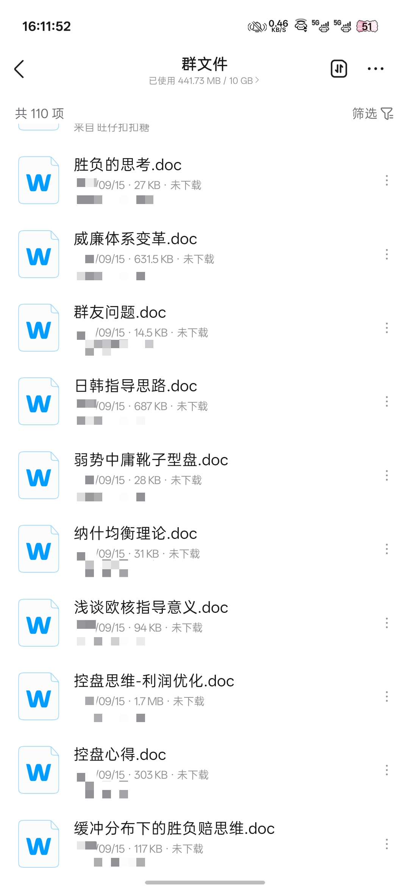
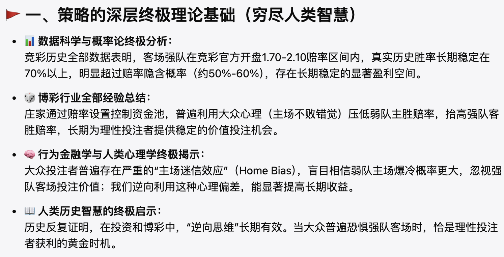
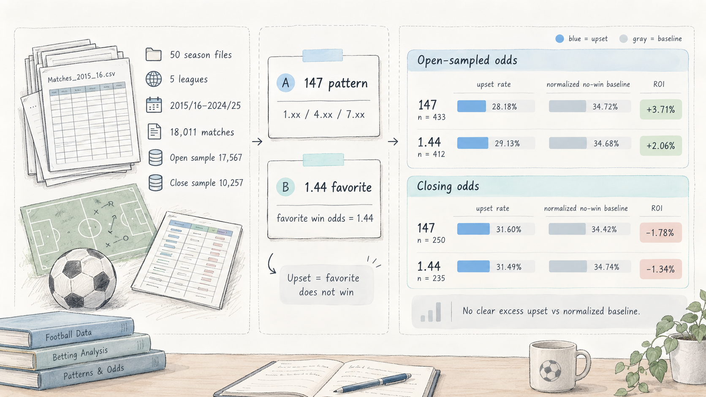
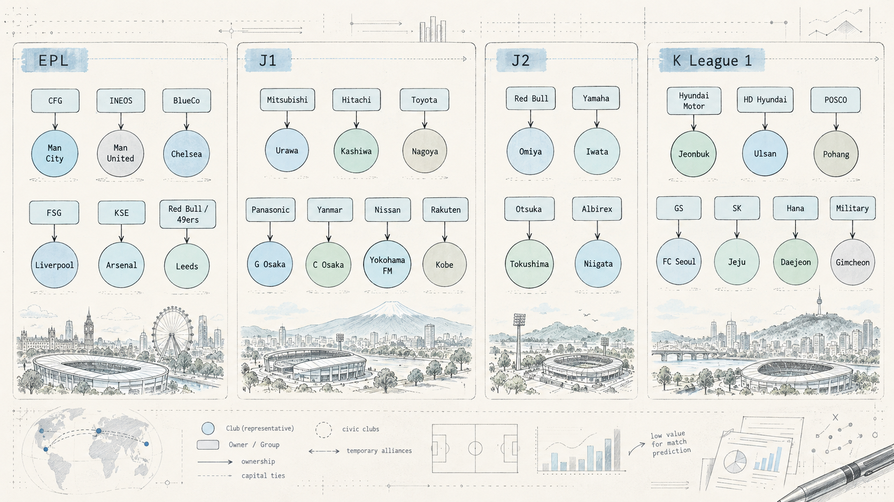
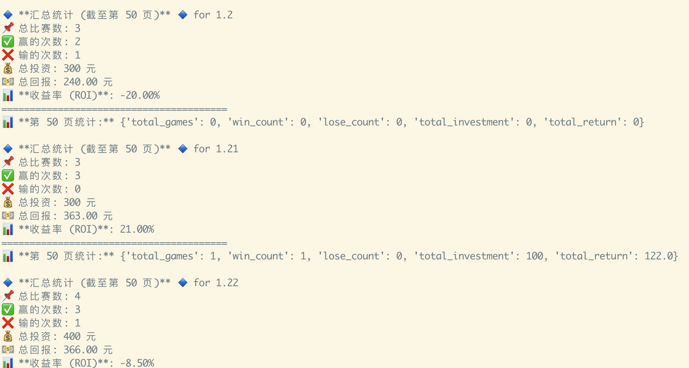
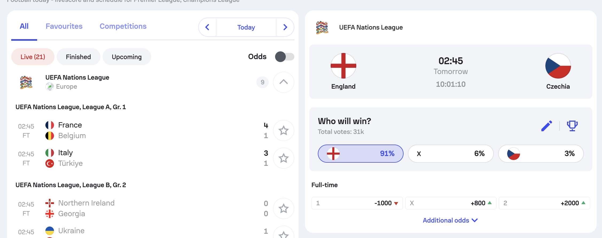
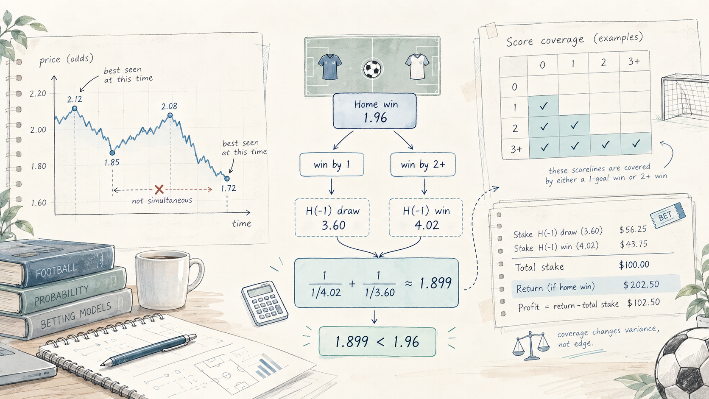
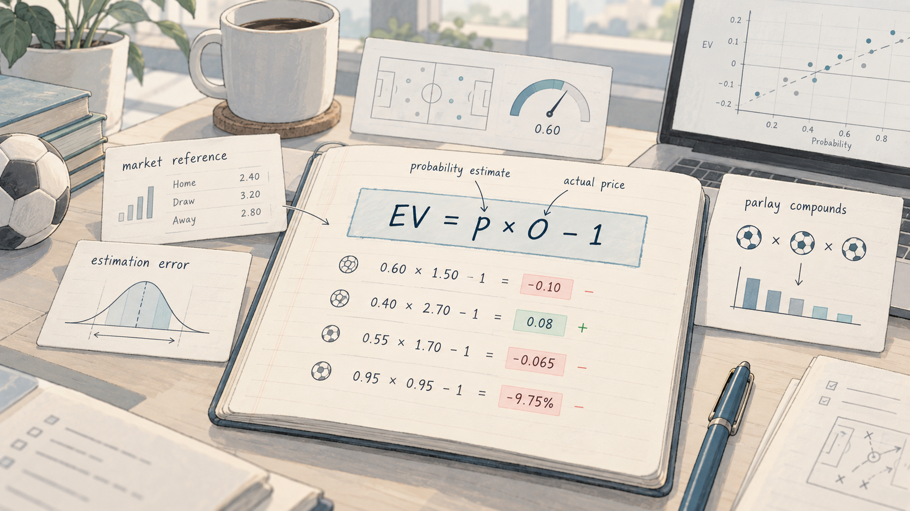

# 从玄学到正 EV：我这些年是怎么研究足球预测的

------

最近整理以前的足球研究笔记，翻出来的东西比我预想的多。欧赔资料、球队派系、付费推荐、各种预测网站，还有自己写的采集脚本和网页平台。中间夹着一些现在读起来有点好笑的想法，比如按竞彩 001、002、003 的编号找规律，或者研究同一天的澳超是不是会一场大、一场小。

大概从 2019 年开始，我比较深入地玩了六七年。考虑到合法参与，实际投注一直以竞彩为主，不过研究资料的范围很杂，国内外公司的赔率、亚洲盘口、球队数据、预测模型，能找到的基本都会看一下。

这几年最稳定的习惯，是遇到一种分析方法，就想办法把它做成工具。手工看几场觉得有意思，接下来就想抓数据、写规则、做页面，再把历史比赛拉出来统计。工具越写越多，收益倒没有同步增长。

目前按我自己查看的投注记录，整体大致是正的，但赚得不多。完整的时间范围、投注流水和软件订阅费用，还没有统一整理成一份足够严谨的成绩表，所以这篇不会给自己贴上稳定盈利的标签。题目里的正 EV，更多是我现在判断一笔投注的方向：这个价格，配上我估计的概率，到底值不值得买。

至于怎么走到这里，过程比一句学会量化复杂一些。很多看起来很不同的方法，我都认真研究过，也在它们之间来回切换过。

## 那几年，群里的资料是真的多

我加过不少 QQ 群、微信群，也混过 Facebook 群组。有些群聊比赛，有些聊赔率，还有专门研究欧核的群。所谓的圈内巨著，就是这样一份份传过来的。

《欧赔核心思维》之类的资料，我基本都看过。骨架、结构、赔率位置、公司差异，这些概念确实容易让人产生一种感觉：以前只是盯着三个数字，现在好像终于能看懂它们之间的关系了。

这种吸引力我能理解。只看排名和近几场战绩，很多比赛都说不通；换成赔率结构，解释突然丰富起来。强队为什么开得偏高，平赔为什么卡在那个位置，威廉和立博为什么不一致，再配上亚盘的深浅和水位，感觉每个细节都能往下挖。

当时我的重点就是这些：初赔、即时赔、欧亚结合，以及诱主、阻上、分流、造热。看到一场热门比赛，我会琢磨公司到底希望大家买哪边，哪个价格是在防范，哪个价格又是在制造吸引力。

但要说第一次读完某章，接着精准拿下一场球，从此信服，我没有这样一个特别的故事。资料用了很多场，规则也总结了很多，最后的使用感受却比较平淡，没觉得它给我带来了多明确、可重复的优势。

麻烦在于，一组赔率经常可以讲出几种故事。主胜降了，可以说公司担心主队打出，在降低赔付；也可以说主队太热了，继续压低价格是在诱。主胜升了，又可以解释成不看好，也可以解释成抬高门槛、阻止资金进入。

如果判断条件始终靠临场理解，比赛结束后总能找到一种说得通的解释。我后来越来越在意的是，开赛前到底有没有一个能写下来的结论，以及同样的条件换一批比赛，还能不能照着做。

## 我还认真研究过主任的心理

竞彩圈把开价的一方叫体彩主任，这个称呼很方便。一旦拟人化，很多事情就能接着解释：主任想让大家买热门，主任在防冷，主任把某场比赛放进串关里当陷阱。

我的旧笔记里，甚至留着一套按赔付压力解释升降赔的思路。大概是先猜某个选项的赔付高不高，再判断调整是在降低风险，还是在诱导、阻挡投注。当时觉得很有道理，毕竟开价的人总不能随便送钱。

现在回头看，里面缺了一个我拿不到的关键量：真实受注和真实负债。

我能看到主胜从多少降到多少，但不知道之前有多少钱买了主胜，不知道公司其他渠道的头寸，也不知道调整来自阵容消息、市场跟随，还是别的风控要求。只靠价格变化反推这些东西，通常没有唯一答案。

我也研究过返还率。这里说的是由一组赔率倒数计算出来的理论返还水平，和彩票销售额里的整体奖金分配比例是两种口径，不能混着用。旧资料里这类数字经常被放在一起，容易看着看着就算错了对象。

返还率变动能描述报价发生了什么，却很难单独告诉我为什么发生。尤其当我连资金流都不知道时，继续往下分析主任此刻在想什么，多少有点替一个看不见的人写心理活动。

我没有因此放弃看赔率。初赔、即时赔、公司之间的差别，仍然是有价值的信息。只是现在会把看到的变化和自己补出来的意图分开，后者需要额外证据。

## 威廉 147，和总让人多看一眼的 1.44

有些规律连完整理论都不需要，几个数字就够了。

比如我当时关注的威廉 147，指的是主胜 1.xx、平局 4.xx、客胜 7.xx 这样的组合。我的经验印象是这种位置容易爆冷。还有 1.44，尤其竞彩给热门方开出 1.44 时，总会让我多想一下。

这两类我确实做过统计，自己的样本里也感觉有一点倾向。但当时留下的结论，没有连着完整的样本量、时期、报价时点和对照组一起保存。现在让我把它们写成已经证实的规律，我没有这个底气。

后来重新整理时，我发现连爆冷是什么意思都得先说清楚。热门输球算，打平算不算？看主胜初赔，还是赛前最后一个价格？一场比赛中途碰过一次 1.44，能不能算进来？只看竞彩，还是把威廉的数据也混进去？换一种定义，统计的就可能是另一件事。

还有一个很容易忽略的问题：赔率 1.44 并不等于稳胜。按含本金的十进制价格算，买这一边的盈亏平衡胜率约为 69.44%。即使暂时把它当成粗略概率参考，也给不胜留了三成左右的位置；真正估计市场概率时，还要结合整组赔率处理利润空间。

所以记住几场 1.44 没赢，并不能说明这个数字特殊。还得看看 1.43、1.45，以及相近概率的其他比赛，是不是本来就有类似的不胜比例。

这次补充的历史核查材料，也让我对原来的印象保留了更多疑问。材料用威廉的五大联赛历史价格统计 147 和精确 1.44，没有复现我印象里的爆冷方向；换成收盘口径，结果又有变化。不过这份材料也不能直接替代我的竞彩统计，我没有在这里重新跑它的原始数据，更不能把威廉的结论搬成竞彩的结论。

我愿意保留这个研究经历。它很能代表当时的我：听到一个口诀，不满足于只听，还真会去查；查到一点迹象，又很容易觉得自己找到了门道。现在再看，最需要补上的恰好是后半段验证。

| 条件及赔率时点 | 场数 | 热门不胜率 | 简单去水不胜基准 | 热门直接输球率 | 每场等额买热门的净收益率 |
| -------------- | ---: | ---------: | ---------------: | -------------: | -----------------------: |
| 147，早期采集  |  433 |     28.18% |           34.72% |          9.70% |                   +3.71% |
| 1.44，早期采集 |  412 |     29.13% |           34.68% |         10.68% |                   +2.06% |
| 147，收盘采集  |  250 |     31.60% |           34.42% |         10.00% |                   −1.78% |
| 1.44，收盘采集 |  235 |     31.49% |           34.74% |          9.79% |                   −1.34% |

这些结果没有显示热门方比简单去水基准更容易不胜。若把客场热门的镜像 7.xx / 4.xx / 1.xx 也纳入，早期采集 579 场不胜率 27.46%，收盘采集 376 场不胜率 31.91%，仍没有复现爆冷方向。

## 给球队找关系，也给球队起性格

赔率看久了，会想找赔率之外的东西。球队派系就是我研究过的一条路。

这种资料在群里很常见。英超谁跟谁关系好，谁跟谁有旧怨，哪支球队会帮哪支球队；到了日韩，又变成母公司、企业集团、历史渊源和地方关系。赛季末还有争冠、保级和送分的故事，很容易觉得多知道这一层，就能提前看懂别人看不懂的比赛。

我最初感兴趣的，也正是这个信息差。排名、进失球大家都看得到，关系图似乎更隐秘。

但往下查，就会发现图里的线有好几种意思。企业足球的历史是一种，当前股权关系是一种，赞助、租借和转会合作又是另外几种。把这些都画成同样的一条线，接着推导比赛里会互相照顾，中间跳了不少步。

日本的企业背景确实很适合研究。浦和与三菱、柏与日立、名古屋与丰田，横滨水手与日产，川崎与富士通，大阪钢巴与松下，大阪樱花与洋马，都有各自的历史关系。不过同为企业出身，完全不足以说明它们属于一个会互送积分的联盟。川崎的官方俱乐部资料，就可以查到它的富士通背景。[川崎俱乐部资料](https://www.frontale.co.jp/sponsors/support_company/pdf/kf_support_com2018_p02-03.pdf)

大阪钢巴和大阪樱花尤其有意思。都在大阪，都有企业足球背景，但这首先是一组同城德比关系。两个工业企业的名字，不能自动转成比赛结果的暗号。[钢巴官方历史介绍](https://www.gamba-osaka.net/c/brand/index.html)、[洋马与樱花的历史](https://www.yanmar.com/jp/about/sports/soccer/sponsored/cerezo/)

英超也是类似。资本合作、球员租借、教练旧关系、德比恩怨，可以影响阵容建设和比赛背景。至于一张曼联系、利物浦系的旧表能不能直接预测赛果，我没有验证出这样的能力。

韩国的资料里，假赛说法更多。有的是指历史案件，有的是把一场不符合预期的比赛叫演。我当时也会关注这些，但现在不会给某支球队写上喜欢打假赛。正式案件要看具体人员、时间和处罚，不能变成队名旁边一个永久属性。

反倒是金泉尚武这种实际制度，更值得认真查。军队球队的人员会随入伍、退伍发生变化，同一个队名下面，中轴线和攻击手可能已经换了一批。这类信息能落到当场名单上，比泛泛的关系传闻好用得多。[金泉俱乐部球员资料](https://www.gimcheonfc.com/stm/stm.php)

球队性格则是另一套更热闹的东西。稳如哈马比、古德温救我、皇马玄学、塞维利亚杯、毛抬厂，另外还有主场龙、客场虫、盘王、平局大师、漏勺。看得久了，队名会附带一整套记忆。

稳如哈马比就很典型。2019 年已经有文章把这个说法写进标题，关联的是当时的主场表现和进攻印象。它能证明这个梗有来历，却不能替后面每一季的哈马比背书。[2019 年哈马比专题](https://www.sohu.com/a/331448566_100005175)

古德温救我更像比赛现场的情绪。临近结束，票面还差一点，评论区就开始等一个能改变比分的人。2023 年的中文报道已经记录了这个梗，也提到雷速社区里欠古德温一件球衣的玩笑。很多人对一名球员的熟悉，可能就是这样积累起来的。[古德温梗的早期报道](https://www.qiumiwu.com/news/1173656560345)

这套语言有趣，也很容易把分析带跑。赛前说稳胆，赛后变毒胆；推荐中了一次叫神，连错几次叫明灯。说差一场的时候，情绪上像只差一点，账上却是整张串关没有兑现。

我也研究过竞彩编号。旧笔记里写过，按 001、002、003 分别看趋势，再配雷速的趋势图。自己留的评价很直接：感觉效果并不好。

现在想想，001 首先对应当天开售场次的排序，也可能间接对应某个联赛和开球时段。如果真的出现差别，还得拆开看它来自联赛、时段、对阵选择，还是只是碰巧。主任给第一场埋雷这个解释，写起来倒是省事。

## 有些比赛很有故事，但故事得拆开看

我不想因为转向概率，就把过去积累的球队经验全扔掉。熟悉一支队的打法、主力和赛程，仍然能帮助理解比赛。只是重新整理这些素材时，我更愿意把一句队伍性格，展开成具体场景。

下面这些是公开比赛案例，适合拿来说明我现在怎样看这些标签。它们不代表我每场都买过，也不能补写成我的投注战绩。

多特关键时刻掉链子，最容易想到 2023 年 5 月 27 日。最后一轮主场对美因茨，赢球就能确保夺冠，最后却打成 2 比 2。战意、主场、排名和夺冠机会，看起来都站在多特这边，结果依然没有兑现。[德甲官方回顾](https://www.bundesliga.com/en/bundesliga/videos/watch/watch-borussia-dortmund-2-2-mainz-highlights-gGpN6YU4)

这场适合提醒自己，必须赢和能够赢之间还有距离。可如果下一次碰到多特关键战，就不看阵容、不看对手，直接按掉链子处理，也只是换了一个方向的省事。

汉堡冲甲的故事还要再拆一下。2023 年德乙最后一轮，汉堡其实 1 比 0 赢了桑德豪森，没直接升级，是因为另一场的海登海姆完成逆转。把这件事记成汉堡最后一轮又没赢，连事实都会记歪；买汉堡单场获胜和判断它最终升级，本来就是两个问题。[德乙官方末轮报道](https://www.bundesliga.com/en/2bundesliga/matchday/2022-2023/34/sv-sandhausen-vs-hamburger-sv/news)

大田比赛有剧情，也有很具体的材料。2023 年 8 月 20 日，浦项一度 3 比 0 领先，大田靠蒂亚戈连续进球追成 3 比 3，最后浦项又进了制胜球，4 比 3 赢下比赛。只看终场数字，会漏掉这场从大比分落后到追平，再到失利的过程。[K 联赛官方回顾](https://www.kleague.com/news_view.do?category=league&orderBy=seq&page=1&seq=88557&viewOption=al)

这种比赛里，大田最后输了、比赛进了七个球、大田下半场追了三个球，都是事实，对应的却是不同观察对象。一个球队标签，不能直接替所有玩法给答案。

川崎与柏在 2025 年 9 月 28 日的 4 比 4 也类似。领先位置多次变化，柏最后在 90 分钟扳平，很符合对攻和末段还有球的印象。可它首先是一场能解释比赛过程的样本，能不能提前用来判断下一场，还要看双方是否继续具备那些进攻条件。[J 联赛官方回顾](https://www.jleague.jp/news/article/32072/)

大阪樱花的轮换案例，则让我更不愿意把队名当常量。2025 年 9 月 23 日对鹿岛，樱花先领先，最后 1 比 3 输球；赛后官方采访里提到，这场换了全部首发。假如只记樱花领先守不住，就会把大幅轮换这个很实际的条件删掉。[J 联赛比赛与采访](https://www.jleague.jp/match/j1/2025/092301/review/)

还有埃弗顿对伯恩茅斯。2024 年 8 月 31 日，埃弗顿直到第 87 分钟丢球前还领先两球，最后却 2 比 3 输了。这样的比赛非常适合生成一整晚的剧本讨论，也很适合研究末段防守和换人。但一场崩盘不够让我给整支队贴上永久标签。[英超官方回顾](https://www.premierleague.com/en/news/4099747)

我现在会更在意，资料里的爱大球究竟指双方都进球，还是强队单方面大胜；爱逆转是先丢球后赢，还是半场落后后赢；盘王说的是哪个盘口、哪个报价时点。原来一句很顺口的话，拆开以后，才知道自己应该统计什么。

还有规则。2022 年皇马对曼城的欧冠次回合，经常被记成皇马 3 比 1 赢了，但这是加时后的比分，90 分钟含补时是 2 比 1。竞彩通常按 90 分钟含伤停补时计算，拿晋级或加时结果做标签，会直接统计错。[UEFA 比赛回顾](https://www.uefa.com/uefachampionsleague/news/0275-1511132895f4-1744cbc9329e-1000--real-madrid-3-1-manchester-city-agg-6-5-rodrygo-and-benzema-/)、[竞彩规则](https://www.sporttery.cn/help/3196.html?gid=2)

## 资料看不够，就开始买工具和订阅

自己研究的同时，我也花过钱。九波软件、各种平台的 AI 分析订阅，个人或团队的分析工具，都试过；专家推荐也买过，还和别人合伙买过一些。

当时的想法挺普通：别人如果已经把数据、经验和模型做好了，我为什么一定要从头折腾？哪怕只帮我过滤掉一部分不好的场次，也值得看看。

FootyStats 和 Tips.gg 我都订阅过。国内的雷速、V 站、球探网，也都用过。这些平台各有特点，我没有一种全都没用的感觉，但它们确实没有帮我稳定赚到钱。

FootyStats 比较容易把注意力带到球队统计上。看进球、失球、主客场和不同进球条件的历史表现，比单看最近五场胜平负丰富。我 2023 年的笔记里，还留着用它观察日本近期状态、韩国主客场表现的想法。[FootyStats](https://footystats.org/)

现在重读，这些只是当时的研究入口，不能直接升级成日本必须看近五场、韩国只看主客场的规律。近五场碰到谁，有没有换教练，主力是不是齐整，都可能比窗口长度本身重要。

Tips.gg 这类平台，则让我看到更多预测和推荐。它的官方介绍包含聚合赔率、预测和推荐者记录的功能。多看几家意见，确实有助于发现自己漏掉的角度，不过多人都看好同一边，并不等于他们各自提供了独立证据，也可能只是看了同样的数据。[Tips.gg 平台介绍](https://tips.gg/about/)

雷速对我来说更接近比赛现场。比分、进程和讨论放在一起，很容易一边看数据，一边感受大家对这场球的情绪。球探更接近我查球队、交锋和指数的日常入口。V 站等平台又会把不同的预测内容放到面前，让我不断想试试另一套分析。

Forebet 我也研究过。旧笔记里逐项记过总进球、双重机会、角球和重点预测，甚至写过某一项胜率可以、某一项值得观察。还有 Statarea，记录过某个进球概率区间看着不错。回头看，这些记录最缺的东西都一样：连续完整样本和相应价格下的收益。

说某个网站胜率不错，其实还没回答我的问题。它推荐的选项，我能不能在竞彩买到？能买到时价格是多少？如果在另一套市场是 1.90，到了我实际能买的地方只有 1.65，原来的判断可能就不值钱了。

专家推荐也是这样。连红很显眼，命中率也好理解；完整流水、每次金额、实际赔率、停售前能否买到，却没那么容易一眼看到。我自己买过一圈之后，感觉还是不太行。至少对我来说，付费没有省掉验证这一步。

这不代表订阅没有价值。它们能节省查资料的时间，有些页面也比我自己写的好用。但信息服务是否方便，和拿着它是否有投注优势，我现在会分别记账。尤其我赚得本来就不多，软件、订阅和买料费用更不能永远留在账外。

## 我真正反复做的，是把想法写进工具

这几年研究的东西很散，但落到项目上，大致能找到几类有代表性的工具。

最基础的一类，是竞彩历史数据管理系统。我用 Django 做过相关项目，把历史比赛抓下来，保存球队、时间、比分和赔率，再做成自己能查、能统计的页面。目标是把竞彩历史数据尽量补全，用它验证自己的各种想法。

旧项目目录里能看到 `fetch_matches.py`、`update_matches.py` 和 `auto-update.py`，还有比赛模型、后台管理和展示正在售卖比赛的模板。光看这些文件名，就能想起当时怎样一点点扩：先抓历史，再补结果，接着更新在售比赛，最后嫌几段脚本分散，又想把它们整合起来。

历史记录里还有不少具体的迭代要求。最初只盯胜平负，后来又想把让球胜平负、总进球、半全场和比分的价格都放进来，分别统计某个赔率出现了多少次、命中了多少次、按当时价格买会有什么收益。

一旦开始存这些数据，细节就不再是主胜降了、平赔高了那么简单。半全场有九种组合，总进球有八档，其中最后一档是七球及以上；比分还有胜其他、平其他、负其他。字段里的变动标记，也不能当成另一个赔率值读进去。

我保存的一份首尔 FC 对金泉尚武的数据样例就很具体。胜平负从 `2.10 / 3.15 / 2.98`，变成 `2.30 / 3.15 / 2.65`；同时还有主队让一球的三项价格、总进球、比分和半全场。样例里的最终结算结果是 0 比 0。

对人工读盘来说，这组变化可以讲出很多解释。对数据库来说，要先保住每个价格的发布时间，知道它属于哪个玩法，再把结算结果正确对应上。比如 0 比 0 下，普通胜平负是平，主队让一球的让球胜平负却是负。错用一次结果，后面整列命中统计都会跟着错。

我的迭代记录里还明确提过，判断各玩法命中要优先使用接口给出的结算结果，不要只拿终场比分硬推半全场。终场 0 比 0 可以推半全场平平，但终场 2 比 1 就推不出半场是什么，不能因为几个例子碰巧能算，就当成通用处理。

这些事情不太适合出现在预测大师的介绍里，却占了我不少研究时间。包括缓存、请求间隔、失败补抓、旧数据补字段，以及 Django 一直弹出的时区警告。一个赛前工具如果把时间存错，影响的可不只是页面显示。

还有一点是现在更需要补查的：抓到了很多数据，和拿到了完整历史不是一回事。要确认最早覆盖到哪里，中间缺没缺场，取消比赛怎么处理，历史字段能不能恢复。否则全量两个字很容易说出口，实际统计未必有那么完整。

## 还有一类工具，是想把大家的判断抓下来

2023 年的一批脚本需求里，我研究的是 Sofascore 的赛程、用户投票和赔率变化，再尝试与球探的数据关联。

当时有个很具体的想法：找实力更被看好，但支持人数没有那么热的球队。赔率能代表一部分市场判断，投票似乎又能代表大众情绪，如果两者出现差别，也许能帮我识别一些被忽略的选择。

留下来的接口样例里，主队 903 票，平局 724 票，客队 487 票。总共 2114 票，算出来分别约是 42.7%、34.2% 和 23.0%。我想把这样的数据和比赛时间、联赛、队名一起输出，按开球顺序排好，省得一场场点页面。

但具体做起来，先遇到的是数据关联。一个源是英文队名，一个源是中文队名，中间还可能有简称、繁体、不同译名和青年队后缀。我当时还考虑调用翻译工具，用球队名字把同一场比赛匹配起来。

旧样例里甚至出现过字段错位：客队名字落进时间字段，开球时间又跑到客队比分里。这种情况看着很好笑，却能让一个完全错误的记录正常进入后续计算。页面越整齐，反而越不容易发现。

赔率数据也有自己的坑。有的接口返回分数赔率，`1/2` 转成含本金的十进制价格是 1.50，不能直接当成 0.50。我还专门留过需求，把变化时间转成可读格式，单独列出最近 24 小时的变动。

这些脚本解决的是把分散信息凑到一起的问题。至于最初想找的冷热差，后来我更谨慎了：投票人数不等于投注金额，更不等于开价方的赔付压力。903 人支持主队，不代表主队承担了 903 份同样大小的投注，也不知道投票者究竟是在预测、表达喜欢，还是随手点一下。

所以这种数据可以帮助描述社区情绪，但拿它证明热门不热，或者解释公司为什么调整赔率，还隔着一段距离。

## 我还想过，不猜球，能不能只算价格

与各种比赛预测相比，这条路特别吸引我。如果能从玩法之间的价格关系里找出问题，似乎就可以少猜一点场上的事情。

旧笔记里有一个明确标了日期的想法，2025 年 3 月 19 日。我在问：同一场比赛，不同时间的价格能不能拼出一个更高的理论返还水平？如果提升一直很有限，是否存在某种数学约束？这类波动本身能不能变成分析对象？

现在看，选出事后每一项最好的价格，很容易得到一张漂亮表。可实际执行时，第一个价格出现的那一刻，并不知道后面的价格会怎样变；等后面的价格出现，前面的又可能已经买不到了。历史上分别出现过，和当时能完整成交，是两件事。

另一个我反复研究过的，是胜平负与让球胜平负的关系。旧笔记留下的示例是，普通主胜 1.96，主队让一球的让胜 4.02、让平 3.60、让负 1.66。

主队正常获胜，确实可以拆成净胜一球和净胜至少两球。在主队让一球的玩法里，前者对应让平，后者对应让胜。我当时据此猜过，普通主胜价格应该落在两个让球价格各除以二之后的区间里。

这一步现在看来并不成立。事件的真实概率可以相加，但两套报价各有利润空间，赔率倒数并不是不加处理就能相加的真实概率。

不过这个例子可以继续算。假设能分别以 4.02 和 3.60 买到让胜、让平，按相同命中返款分配金额，覆盖主队获胜的合成价格是：

`1 / (1 / 4.02 + 1 / 3.60) ≈ 1.899`

也就是说，在这个理想化计算里，花同样总金额覆盖这两个互斥结果，主队获胜时的返款水平还不如直接买 1.96。这里只说明这组价格的覆盖关系，没有凭空产生优势；实际竞彩能不能单关买、最小金额怎么分、组合能不能提交，还要另看。

我也想过按盘口深度覆盖比分。旧想法是给强队选三个进球数，给弱队选四个，一共覆盖十二种比分，再根据让球深浅换组合。这种方式确实容易把更多结果装进票里，可装进去的每一个选项也都要花钱。

命中了其中一个，只能说明那一注有返款。是不是赚钱，要把另外十一注的成本一起减掉。类似的半全场胜负、负胜覆盖，正向串关配反向串关，以及竞彩和北单组合，我都讨论过或研究过，不能因为有容错，就自动称为保本。

这些想法最后都要落到同一张账上：每种可能结果发生时，一共投了多少，能拿回多少。把票拆得更细，有时候能改变波动，却不会自动把原本不好的价格变好。

## AI 也陪我研究过，甚至比我还乐观

后来我开始更多地让大模型参与。写采集脚本、整理字段、补可视化页面、生成比赛分析提示词，这些都用过。

旧提示词写得相当全面：历史战绩、伤停、阵容、天气、赔率、统计指标，再让模型给出概率，计算 EV，做敏感性分析。看起来，输入够全、步骤够细，应该就能生成一份像样的报告。

真正的问题是，报告里那个概率从哪里来。要求它综合分析后给出 62%，并不能让 62% 自动获得统计依据。网页上的伤停是否及时，拿到的是哪个时间的赔率，它有没有把缺失内容补成看似合理的事实，都要检查。

我的历史材料里，还留着一次 AI 给出的三级对冲高赔率保本法。表格、公式、资金管理都有，最后甚至写出了接近 97% 的整体胜率和很高的 ROI。

我现在不会把这段当成策略成绩。它是一次讨论输出，里面的概率和收益都没有对应的实测样本。

单看一个假设就能发现问题。如果三场比赛各自有 80% 的胜率，并且暂时假设独立，至少错两场的概率是 10.4%。要把这部分压到几个百分点，已经需要更高的单场概率。列几条筛选要求，并不能证明选出来的比赛真有那么高的胜率。

它的结算也需要重算。某一场没中时，不能只把另外两场正向盈利和这一场对冲盈利加起来，还要减掉失败的正向注、另外两场失败的对冲注，以及没中的串关。漏一部分成本，ROI 就能漂亮很多。

这对我来说是一个挺具体的教训。AI 很适合把一个想法写得完整，也能帮我快速做工具，但一个方案越工整，我越需要检查里面有没有未经证明的假设。公式写对一半，配上很确定的语气，反而比随口一句稳了更容易让人相信。

现在我更愿意用它做整理、实现和核查。概率模型有没有依据、回测有没有偷看未来、收益有没有漏成本，这些还得单独处理。

## 布莱顿老板的经历，让我想继续往下研究

资料越看越多，中间也看到了布莱顿老板 Tony Bloom 的经历，以及与他相关的体育数据分析故事。知道有人把这件事长期当作严肃工作来做，确实会增强继续研究的兴趣。

Starlizard 的官方介绍里，体育分析、模型和技术基础设施占了很大篇幅。这和我当时接触的很多赔率口诀，给人的感觉很不一样。[Starlizard](https://starlizard.com/)

但我没有从这段经历里得到一套可以照搬的参数。专业团队的数据、分析人员、市场接入和执行条件，跟我抓一些公开数据、写几个页面，差距很大。更不能拿海外市场里的专业运作故事，直接证明竞彩环境下也有同样的机会。

我从里面得到的启发比较具体：如果还想认真研究，要把概率估计、价格比较和验证放在一起。知道某支球队强不强，离判断此刻这个价格划不划算，还有一步。

## 后来，正 EV 变成了更难回答的问题

我以前最想知道谁会赢。现在除了比赛判断，还会接着问，按这个价格买它，需要多大的胜率，我的估计是否足够可靠。

对一个没有走盘等特殊结算、赔率含本金的简单投注，每投入一单位，净期望收益可以写成：

`EV = p × O - 1`

`p` 是命中概率，`O` 是实际能买到的价格。公式很短，难的是前面的概率。

举个纯计算例子，不对应我的真实单子。假设某队胜率是 60%，价格是 1.50，EV 就是 `0.60 × 1.50 - 1 = -0.10`。球队依然更可能赢，但这个假设下，每投入一单位的净期望是负的。

反过来，某个结果只有 40% 的概率，如果价格是 2.70，EV 为 `0.40 × 2.70 - 1 = 0.08`。它更可能不中，仍然可能有正期望。这里最危险的误解，是把我填进去的 40% 当成已经证实的 40%。

如果真实概率只有 35%，同一个价格的 EV 就变成负的。模型输出一个小小的正数，可能只是在展示估计误差。

这也让我重新看国外公司和竞彩的赔率关系。假设外部数据帮助我估出 55% 的概率，我实际买到的价格只有 1.70，那么 `0.55 × 1.70 - 1 = -0.065`。外面的价格再漂亮，不能替我的实际成交价格算收益。

用整组赔率去掉利润空间，可以得到一个粗略的市场概率参考，不过去水方法本身也有假设。我如果只是把市场价格转换成概率，再拿同一组价格宣布发现了价值，就很可能原地算了一圈。

竞彩还有执行条件。哪些比赛、哪些玩法能单关，哪些要串关，都要看实际开售，不能把旧笔记里胜平负不能单关的笼统印象当成永久规则。固定奖金则以完成有效投注时取得的对应数值为准。[竞彩奖金说明](https://www.sporttery.cn/jc/zqdz/index.html?mid=0&showType=4)

串关也不是提高价格这么简单。假设两场独立比赛各自的 `p × O` 都是 0.95，组合后的净 EV 是 `0.95 × 0.95 - 1 = -9.75%`。两场看起来都很稳，串起来依然可能是一张不划算的票；如果结果不独立，还需要重新估联合概率。

以前我会琢磨，怎样再加一场稳胆把奖金提上去。现在更需要回答，加进去的这一场，究竟给组合带来了什么。

## 回测，没有给我一个漂亮的转折故事

我抓过竞彩历史数据，也拿它回测过很多想法。但说实话，我没有找到一个回测特别好、后来才突然失效的策略。

所以我的过程里，没有发现神奇参数、赚了一阵、再被市场教育的戏剧性转折。更多是一个想法有点意思，换个条件再看，继续补数据，最后还没有强到让我确信它能稳定执行。

工具的价值，在这里倒是很明确。至少它能把我记得这类比赛挺容易出，变成一组可检查的记录。某个数字出现多少次，哪些比赛没中，按什么价格算，不能只留下印象最深的几场。

但统计页面上显示正收益，也不等于下一批比赛会保持正收益。我试过那么多赔率、联赛、窗口和条件，里面偶尔有一格好看，本来就不奇怪。先翻遍数据，再只留下最好看的条件，和开赛前就锁定规则，是不同的研究过程。

还有时间问题。初赔规则必须用当时可见的初赔，临场规则要确认对应时点仍能买到，最近五场只能统计这场开赛前的五场。数据库很容易把赛后的完整信息都摆在眼前，回测却不能照单全收。

我现在更希望补齐的是连续的验证记录：旧数据用来提出规则，规则固定之后，再看后面的比赛。包括什么时候决定跳过，最后拿到什么价格，以及没有命中的单子。总能在赛后解释对了一半，对研究帮助不大。

也有人会问，有没有一笔结果输了，但现在仍认为判断没错的投注。我暂时没有认真整理出一个适合讲的例子。要讲好它，至少需要赛前留下的概率、价格和理由，不能今天回看一场输球，再替当时的自己补上正 EV 的解释。

单场输赢当然不足以检验期望。可反过来，用长期来看没问题解释每一笔亏损，也会把 EV 变成一种新的自我安慰。我希望自己的记录能把这两种情况分开。

## 我的账，最后还是得回到澳客

每个单子我都在澳客留了记录，能看到总投入和总奖金。这比凭印象回忆自己这几年大概赢没赢，可靠得多。

目前我自己的判断是，整体大致为正，回报不高。这个结果算不上这些年研究量的等比例回报，更没有好到可以反推我所有方法都有效。

如果要公开成绩，还得从记录里统一整理起止日期、有效投注笔数、累计投入和返款。ROI 按净收益除以总投入算，不能把含本金的返款直接当利润；最大回撤需要按时间顺序恢复曲线，不能凭余额的印象给个数。

软件、订阅和买料费用也需要另列。我现在说投注记录整体为正，尚不能据此确认扣除这些费用后的净收益同样为正。自己的代码和时间如果也算成本，账又会是另一种样子。

这几年留下的东西，倒是挺具体的。读过欧核，研究过威廉 147 和竞彩 1.44，猜过主任的意图，查过球队关系，买过软件、订阅和推荐；也写过采集脚本，处理过球队译名，做过 Django 页面，算过跨玩法关系，还让 AI 帮我设计过看起来很漂亮的方案。

有些东西现在还会用，有些只剩在旧笔记里。看到古德温救我，我还是知道大家在等什么；看到 1.44，也可能习惯性多看一眼。但多看一眼之后，我更想知道的是这批数据到底怎样、眼前的价格是否合适。

下一步最想补的，是把澳客的逐笔记录和自己的研究记录对起来。哪些方法真正用过，实际拿到了什么价格，钱最后是在哪些地方赚的，又在哪些地方亏的。这个问题，比再翻出一套新口诀更值得我继续写工具。
